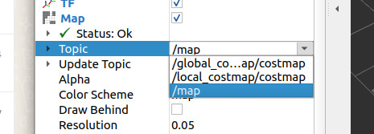

# **IRIS Description and Navigation**

Simulation repository for iris robot base

## **Requirements**

* Ubuntu 22.04.3 LTS
* ROS 2 Humble Hawksbill

## **Install dependencies**

Gazebo
```bash
sudo apt install ros-humble-gazebo-*
```

Nav2
```bash
sudo apt install ros-humble-navigation2 ros-humble-nav2-bringup
```

slam_toolbox
```bash
sudo apt install ros-humble-slam-toolbox
```

## **Tutorial**

Create a workspace for the project:

```bash
mkdir -p ~/iris_ws/src
```
```bash
cd ~/iris_ws/src/
```

Clone the repository and change the branch:
```bash
git clone git@github.com:IRIS-robot/iris_description.git
cd iris_description/
git checkout testing-urdf
```

Build the project and add to the bashrc:
```bash
cd ../..
colcon build
add to .bashrc "source ~/iris_ws/install/setup.bash"
echo 'source ~/iris_ws/install/setup.bash' >> ~/.bashrc
```

Run the slam launch file:
```bash
ros2 launch iris_description slam.launch.py
```
It should open the RVIZ and Gazebo page with robot base model

### **With rviz open add the topic /map and choose it as Fixed Frame:**



### **Move around with teleop to map**


### **Run Nav2 in other terminal:**
```bash
ros2 launch nav2_bringup navigation_launch.py use_sim_time:=true
```

### **Use 2d goal pose in rviz to navigate:**
